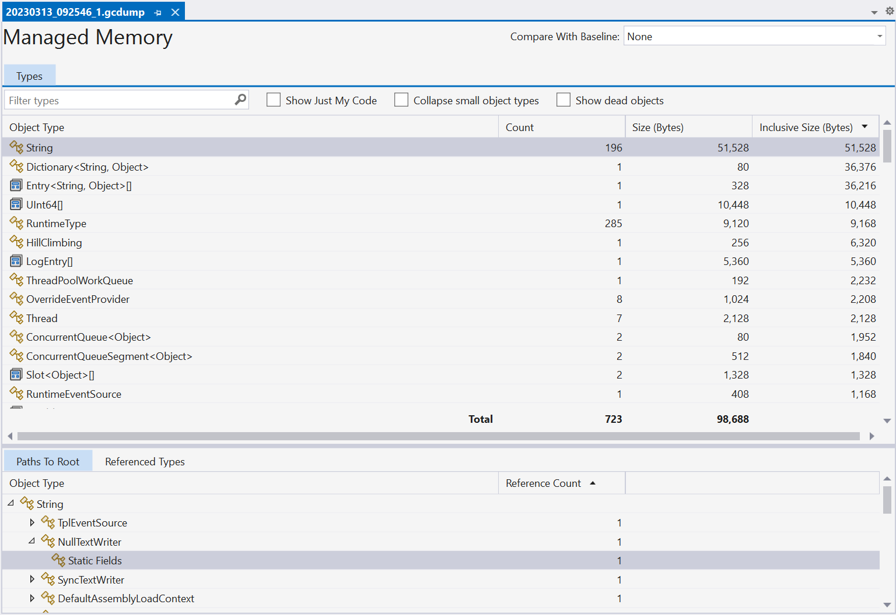

# mono-gcdump

## Introduction

The mono-gcdump tool is a close cousin to the [dotnet-gcdump tool](https://github.com/dotnet/diagnostics/blob/main/documentation/dotnet-gcdump-instructions.md). It produces .gcdump files from MonoVM processes that capture the managed heap state for analysis. The gcdump files can be viewed in Visual Studio, or [PerfView](https://github.com/microsoft/PerfView).

## Usage

There are three ways to use the tool:
- Capture a .nettrace file using the [dotnet-trace tool](https://github.com/dotnet/diagnostics/blob/main/documentation/dotnet-trace-instructions.md) with the `collect --providers Microsoft-DotNETRuntimeMonoProfiler:0xC900003:4` option, and use `mono-gcdump convert` to turn the .nettrace file into .gcdump file.
- Use `mono-gcdump collect -p <process id>` on a running process, or `mono-gcdump collect --diagnostic-port <diagnostic port>` if using [dotnet-dsrouter](https://learn.microsoft.com/en-us/dotnet/core/diagnostics/dotnet-dsrouter) with a mobile application. This produces the .gcdump file directly.
- Use `mono-gcdump collect --interactive` like the option above to collect more GC dumps of the same process. This is particularly useful with the option to diff multiple .gcdump files in Visual Studio.

### Example: Dumping heap of Android application

- Install the `dotnet-dsrouter` tool using `dotnet tool install --global dotnet-dsrouter`.
- Connect to your Android device using `adb` and run `adb shell setprop debug.mono.profile '127.0.0.1:9000,suspend'`.
- Run your application on the device.
- Make sure the `ANDROID_SDK_ROOT` environment variable points to the Android SDK location.
- Run `dotnet-dsrouter server-server -ipcs ~/mylocalport -tcps 127.0.0.1:9000 --forward-port Android` (on Windows use `mylocalport` instead of `~/mylocalport`)
- Run `mono-gcdump collect --interactive --diagnostic-port ~/mylocalport,connect -o memory.gcdump`.
- Press `d` key to collect a dump.
- Open the generated `memory_1.gcdump` file in your tool of choice.

Follow the [dotnet-dsrouter documentation](https://learn.microsoft.com/en-us/dotnet/core/diagnostics/dotnet-dsrouter) for more details on how to setup the diagnostic ports, and for troubleshooting common issues.

### Example: Dumping a desktop application with MonoVM runtime

- Publish your application with the Mono Runtime (`-p:UseMonoRuntime=true -r <runtime identifier>`) and run the published executable with `DOTNET_DefaultDiagnosticPortSuspend=1` environment variable.
- Run `mono-gcdump collect --interactive -p <process id> -o memory.gcdump`.
- Press `d` key to collect a dump.
- Open the generated `memory_1.gcdump` file in your tool of choice.

## Limitations and known bugs

### All GC roots are reported as "Other roots"

Normally the tool tries to attribute the GC roots into different sections, such as "Thread stack", "Finalizer", "Static variables", etc.

Unfortunately due to the limitations of the Mono Log Profiler API this only works in the `collect --interactive` mode if the collection is started right from the process start. This enables capturing the "GC root register" and "GC root unregister" events that enable proper attribution of the GC root addresses.

Furthermore, the "GC roots" event incorrectly reports the addresses, so a runtime with [this fix](https://github.com/dotnet/runtime/pull/83284) is necessary.

### Static variable names are not shown

The Mono Log Profiler API currently doesn't offer a trivial way to map addresses to static variable names.

## License

The tool is licensed under the [MIT license](LICENSE.TXT). It uses portions of the tools and libraries from [dotnet/diagnostics](https://github.com/dotnet/diagnostics) and [PerfView](https://github.com/microsoft/PerfView).
